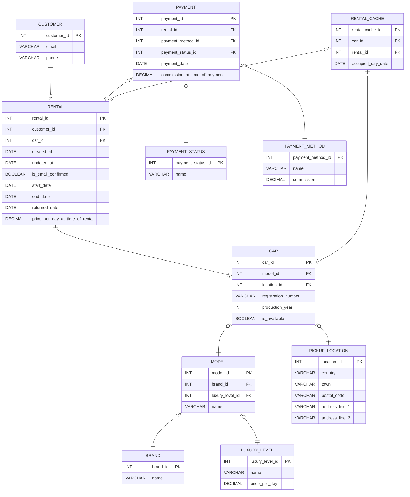

# advanced_databases

Mermaid code:

## Most popular read scenerio

The code of it is included in the `/backend/main.py:/api/rent-car` endpoint.

## Most popular write scenerio

Creating a rental reservation
The code of it is included in the `/backend/main.py:/api/available-cars` endpoint.
